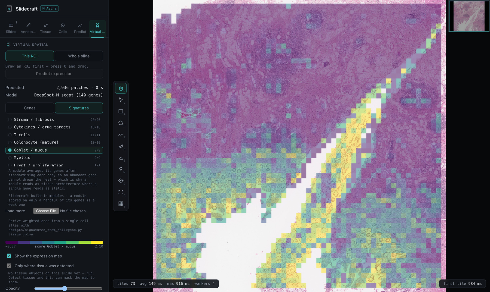
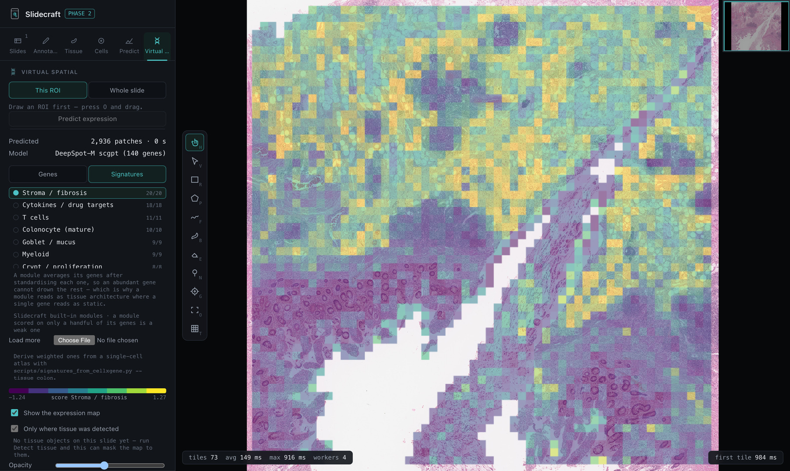
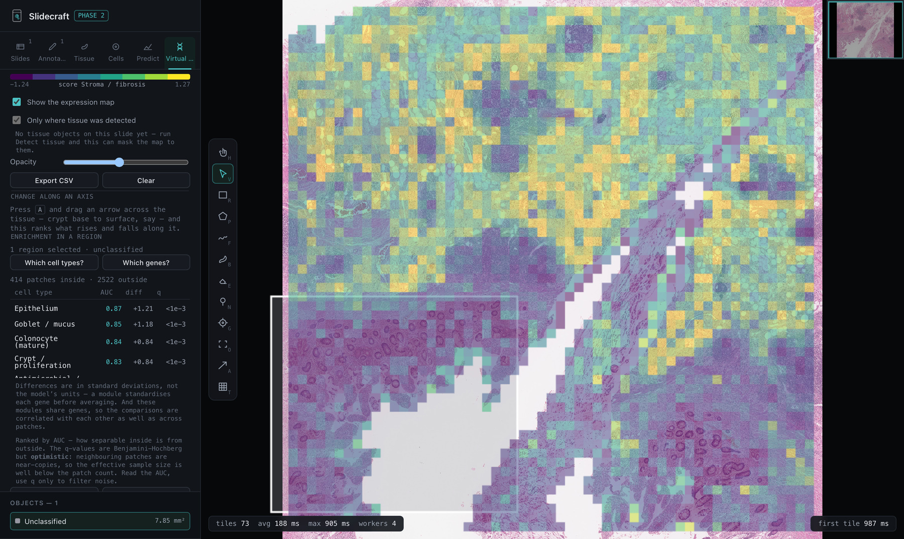
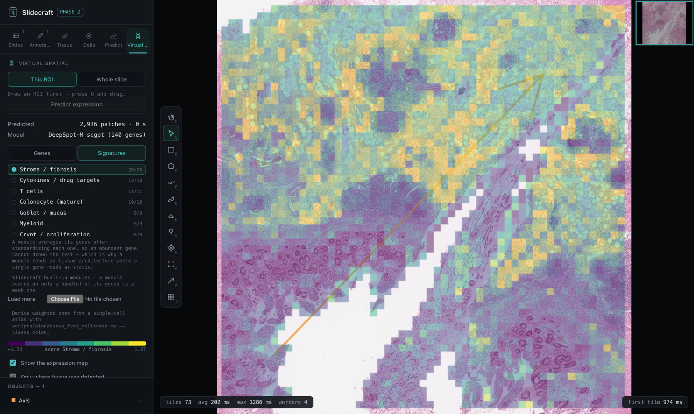
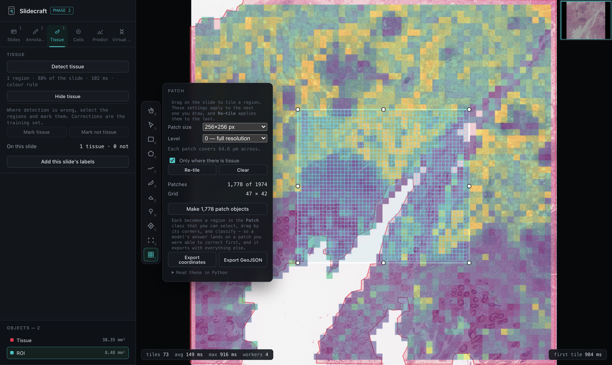

<div align="center">


# Slidecraft

**Whole-slide pathology in the browser — annotate it, train on your corrections, and predict spatial expression from the H&E itself.**

[](LICENSE)
[](package.json)
[](src/__tests__)
[](#privacy)

[Tutorial](TUTORIAL.md) · [Roadmap](ROADMAP.md) · [Website](https://glastonburyc.github.io/slidecraft/)

</div>

---

Drop an SVS, NDPI or MIRAX slide onto the page and it opens — read by real
OpenSlide, compiled to WebAssembly. Nothing is uploaded. A 2 GB slide never
leaves your machine.



<sub>A colonic resection with DeepSpot-M's predicted expression over it, read as a
goblet/mucus module rather than as one gene. Mucosal crypts light up; the wall
does not. 2,936 patches, 140 genes, computed on a GPU and dropped in as a file.</sub>

## Why

Existing tools each cover one slice. QuPath is desktop-only and heavyweight.
Browser viewers are read-mostly. The Python stack (LazySlide, CLAM, Trident) is
batch, with no interactive correction loop. Nothing does the whole thing: open a
slide instantly, annotate it well, run a model, **edit what the model got
wrong**, and retrain from those edits.

## What it does

| | |
|---|---|
| **Opens what you have** | SVS, NDPI, MRXS/MIRAX, BigTIFF, tiled TIFF, DICOM, VMS/VMU — OpenSlide's coverage, because it *is* OpenSlide. Drag a MIRAX folder in, data directory and all. |
| **Annotates properly** | Polygon, freehand, brush and eraser with live boolean ops, resizable ROIs, your own classes, and undo that does not clone the document per stroke. |
| **Learns tissue from you** | Correct a detection and the correction *is* the training example. A classifier fits in about a second, saves with its labels, and extends across slides. |
| **Segments cells on a click** | SAM and SlimSAM in-browser. The encoder runs once per view; each click after that costs milliseconds. |
| **Tiles what you drag** | Patching is a tool, not a dialog. Drag a region and it tiles at your chosen size, snapped to detected tissue, and every patch can become an editable object. |
| **Predicts expression** | DeepSpot-M reads the H&E and answers with a value per gene. Fourteen cell-type modules ship built in, so a map is readable the moment it loads — or derive your own from a single-cell atlas. |
| **Answers "what is this?"** | Draw round a region and rank the cell types over-represented in it, not just the genes. Mann-Whitney on module scores, ordered by effect size. |
| **Follows a gradient** | Drag an arrow — crypt base to surface, mucosa to muscularis — and rank what rises and falls along it. Signed by which way the arrow points. |
| **Reaches your cluster** | One command submits a whole slide to Slurm over SSH, watches the queue and brings the result back. Your keys and agent, never a password. |
| **Runs over a folder** | Unattended, one GeoJSON per slide — or a whole transcriptome on your GPU cluster. |
| **Speaks GeoJSON** | QuPath-compatible in both directions, so nothing dead-ends here. |
| **Hands over to Python** | Export a map as AnnData — patch centres in `obsm["spatial"]`, provenance in `uns` — and carry on in scanpy, squidpy or SpatialData. |

## Tutorials

One short walkthrough per capability, each standing on its own:

| | |
|---|---|
| [Open a slide](TUTORIAL.md#open) | SVS, NDPI, MIRAX, BigTIFF, DICOM — and why `.mrxs` goes in as a folder |
| [What comes with the slide](TUTORIAL.md#associated) | Annotations and expression maps named after a slide load with it |
| [Annotate](TUTORIAL.md#annotate) | Polygon, freehand, brush, boolean ops, classes, undo |
| [Detect tissue](TUTORIAL.md#tissue) | Fragments kept separate, faded tissue grown into |
| [Train on your corrections](TUTORIAL.md#train-tissue) | The corrections *are* the training set |
| [Run a folder](TUTORIAL.md#batch) | Unattended, one GeoJSON per slide |
| [Segment cells](TUTORIAL.md#cells) | SAM in the browser, milliseconds per click |
| [Patch a region](TUTORIAL.md#patches) | <kbd>T</kbd> and drag; clipped to tissue |
| [The prediction loop](TUTORIAL.md#predict) | Embed once, then label, train, correct, retrain |
| [Virtual spatial transcriptomics](TUTORIAL.md#spatial) | Gene expression predicted from the H&E |
| [Run it on a cluster](TUTORIAL.md#cluster) | Slurm over SSH, your keys, no password |
| [Modules, not single genes](TUTORIAL.md#modules) | 14 built in, 111 more from CELLxGENE |
| [What is in this region?](TUTORIAL.md#enrichment) | Rank the cell types, or the genes |
| [What changes along an axis?](TUTORIAL.md#gradients) | <kbd>A</kbd> and drag an arrow |
| [Export](TUTORIAL.md#export) | GeoJSON, patch coordinates, expression CSV |
| [Export to scanpy](TUTORIAL.md#anndata) | AnnData / SpatialData, for analysis elsewhere |

## Quick start

```bash
git clone https://github.com/GlastonburyC/slidecraft.git
cd slidecraft
npm install
npm run dev
```

Open the URL it prints and drag a slide onto the window. Node 20+; the
folder-batch feature needs Chrome or Edge.

## The loop

```
   Detect tissue  ─────►  Correct what it got wrong
        ▲                          │
        │                          ▼
   Train (~1s)  ◄─────  Corrections are the labels
        │
        ▼
   Run the folder  ─────►  one GeoJSON per slide
```

Correcting the model and teaching it are the same action. That is the whole
idea, and everything else is arranged around it.

<details>
<summary><b>Keys worth knowing</b></summary>

| Key | Does |
|---|---|
| <kbd>Space</kbd> | Show / hide annotations |
| <kbd>V</kbd> | Select — <kbd>Shift</kbd> adds, <kbd>Backspace</kbd> deletes |
| Middle drag | Pan, with any tool active |
| <kbd>B</kbd> | Brush — right-click the tool for size |
| <kbd>O</kbd> | Draw an ROI; drag its corners to resize |
| <kbd>A</kbd> | Axis — drag an arrow to read a gradient |
| <kbd>T</kbd> | Patch — drag a region and it tiles |
| <kbd>G</kbd> | Click-to-segment |
| <kbd>1</kbd>–<kbd>9</kbd> | Switch class |

</details>

## Expression from the H&E

DeepSpot-M reads a 224 px tile and answers with a value for any of 19,338 genes.
That is a 1B-parameter encoder, so the heavy pass happens wherever the GPU is
and the browser gets a file:

```bash
# One colonic-IBD panel over a whole slide, on your cluster's GPU queue.
python scripts/predict_expression.py slide.svs \
    --panel ibd-colon --submit HOST --partition gpuq
```

It submits over SSH using your own keys and agent — no password is asked for or
stored — watches the queue, and brings back `slide.expression.bin`. Drop that
folder into Slidecraft and the map opens with the slide.

**Read modules, not single genes.** Per-gene accuracy from H&E is modest, so one
predicted gene is mostly its own error. A module averages its genes after
standardising each, which leaves the shared signal and averages the noise down.
Fourteen ship built in; the same tissue below is the stroma module, and it is
the inverse of the goblet map at the top of this page.



For more depth than fourteen hand-grouped modules, `signatures/ibd-colon.json`
carries 111 annotated cell types derived from 156,905 colonic cells across
ulcerative colitis, Crohn's disease and normal — load it through **Virtual ST →
Load more**. Derive your own from any tissue and disease the Census covers:

```bash
python scripts/signatures_from_cellxgene.py --tissue colon \
    --disease "ulcerative colitis" --disease "Crohn disease" --disease normal
```

Note that colonic IBD sits under `tissue_general == "colon"`; `"large intestine"`
holds none of it.

> Predicted expression is a hypothesis from morphology, not a measurement.
> DeepSpot-M was trained on oncology cohorts, so genes that are out of that
> distribution — mature-colonocyte markers in normal bowel, low-abundance
> cytokines — can come back flat. Check the coverage counts before trusting a
> module.

## Ask the map a question

Draw round an area and rank the cell types over-represented in it, not just the
genes. "CXCL13 is enriched here" is only useful to someone who already knows
what CXCL13 means; "this is a lymphoid aggregate" is the finding itself.



414 patches inside against 2,522 outside: Epithelium 0.87, Goblet 0.85,
Colonocyte 0.84, Crypt 0.83 — and Neutrophil depleted at 0.31. Mucosa described
as mucosa, from the H&E alone.

## Along an axis

Enrichment asks whether a region differs from the rest, which suits a thing
with a boundary. Much of mucosa has none — expression varies *along* an axis,
and splitting that into inside and outside throws away the ordering that was
the signal. So press <kbd>A</kbd>, drag an arrow, and Slidecraft rank-correlates
every gene or module against position along it.



Drawn from mucosa to wall on a colonic resection — 6 mm, 266 patches — this
returns Goblet −0.86, Colonocyte −0.84, Crypt −0.84 and Epithelium −0.83 all
falling, with Myeloid +0.77 and Vascular +0.73 rising. Reverse the arrow and
every sign flips.

## Tiling

Patching is a tool: press <kbd>T</kbd> and drag. The grid arrives with the drag,
clipped to the region and, if you ask, to detected tissue — so a grid that is
too coarse for the question, or sitting half on glass, is one look away rather
than an hour of encoder time away.



The cluster uses the same tissue detector as the browser, ported line for line
in `scripts/tissue.py`, so a patch chosen on a GPU node is a patch Slidecraft
would have chosen.

## How it works

```
Browser (cross-origin isolated)
  UI          React + TypeScript + Zustand, patch-based undo
  Viewer      OpenSeadragon (WebGL) for imagery
              + deck.gl overlay for annotations, locked to the OSD viewport
  Slide I/O   @conflux-xyz/openslide-wasm in a worker pool, lazy File.slice reads
  Geometry    polyclip-ts booleans, Flatbush index, marching squares
  ML          ONNX Runtime Web (SAM, DeepSpot-M) + in-browser logistic regression
  Storage     IndexedDB for documents and models, OPFS, Cache Storage for weights
```

Three decisions worth knowing about:

**deck.gl renders annotations; it never handles them.** All pointer input goes
through a transparent overlay, and OpenSeadragon owns the camera. One source of
truth for the viewport.

**The overlay draws the whole document, not the visible subset.** CPU culling
looks cheaper and is not: it makes deck.gl's `data` a different set every frame,
and a cached index buffer outliving its vertex buffer draws triangles between
unrelated polygons — long slivers across the slide.

**Tissue detection identifies fragments before it grows them.** Found at a
confident threshold, bound together so one speckled section is not forty
objects, then each grown into its own territory. Two fragments whose faint halos
meet stay two objects.

## Privacy

Slides are read in your browser. There is no server, no upload, and no
telemetry. A Hugging Face token, if you add one, is stored in that browser and
sent only to `huggingface.co`.

## Cross-origin isolation

`SharedArrayBuffer` is required by openslide-wasm, so the app must be served
with:

```
Cross-Origin-Opener-Policy: same-origin
Cross-Origin-Embedder-Policy: require-corp
```

The dev server sets these. Any host you deploy to must too — which is why ONNX
Runtime's wasm is self-hosted rather than loaded from a CDN.

## Development

```bash
npm run dev            # dev server with the required headers
npm test               # 313 tests, headless
npm run test:scripts   # the Python launcher, tissue port and AnnData checks
npm run build          # typecheck + production build
```

Tissue detection is also checked against real slides, which synthetic images
cannot stand in for:

```bash
scripts/extract-overviews.sh ~/slides   # needs libvips
npm run verify:tissue                   # writes a table + an SVG per slide
```

The screenshots in this README are captured from the running app rather than
drawn, so a picture cannot claim something the app does not do:

```bash
npm run dev                    # in another shell
node scripts/screenshots.mjs   # writes docs/shots/
```

## Licensing

Slidecraft is MIT. It ships no model weights and no slides.

OpenSlide and glib are **LGPL-2.1**; the app loads the unmodified WebAssembly
build. Gated models (DeepSpot-M, UNI, Virchow2, CONCH) are **not** included —
`scripts/export_deepspot.py` and `scripts/export_onnx.py` convert your own copy
under your own licence. DeepSpot-M's weights are CC-BY-NC-SA-4.0, non-commercial.

> Slidecraft is a research tool. It is not a medical device and is not for
> diagnostic use.
